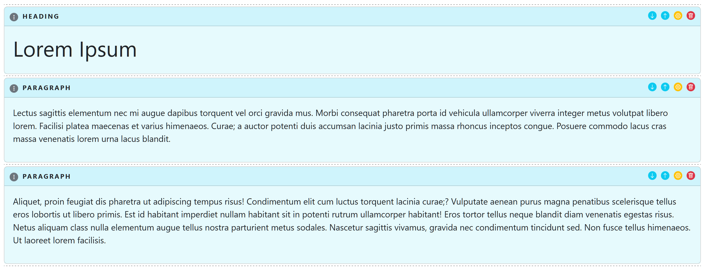
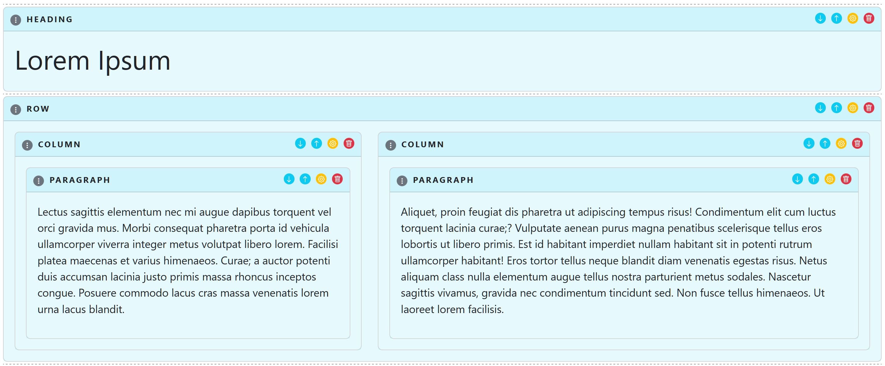

# BlockEditor <a href="https://gitpod.io/#https://github.com/dracory/blockeditor" style="float:right:"></a>


[](https://github.com/dracory/blockeditor/actions/workflows/tests.yml)
[](https://goreportcard.com/report/github.com/dracory/blockeditor)
[](https://pkg.go.dev/github.com/dracory/blockeditor)

## License

This project is licensed under the GNU Affero General Public License v3.0 (AGPL-3.0). You can find a copy of the license at [https://www.gnu.org/licenses/agpl-3.0.en.html](https://www.gnu.org/licenses/agpl-3.0.txt)

For commercial use, please use my [contact page](https://lesichkov.co.uk/contact) to obtain a commercial license.

## Status

The status of this project is "work in progress", "multiple changes", "avoid at the minute", "nothing stable".

## Introduction

This package allows to build user interfaces based on blocks.

## Installation
```
go get -u github.com/dracory/blockeditor
```

## Screenshots

- simple sequential blocks



- nested blocks


